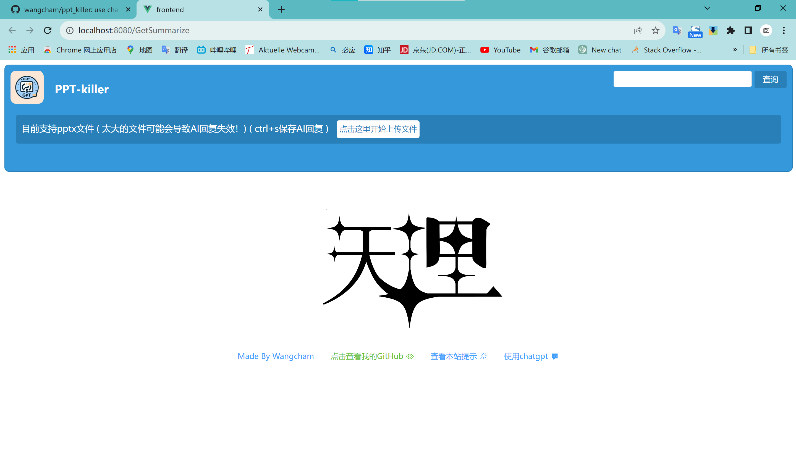
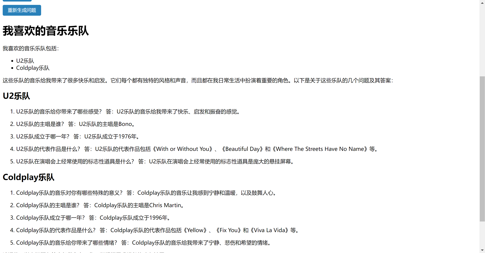

<div align="center">
    
</div>

# PPT-killer

点击使用[公共体验服务](https://www.pptkiller.top)

## 功能

1. 支持将pptx文件投喂给chatgpt，总结pptx的内容
2. 支持根据AI的总结生成与pptx文件相关的问题
3. 支持docker部署并填写自己的API_key和API_base
4. 可选择是否保存AI生成的总结与问题

## 部署

### 基于docker部署(推荐)

#### 配置项：

<strong>API_KEY :</strong>  对应自己的api key（必填）<br>
<strong>API_BASE :</strong> 对应自己的base url（可填可不填）

```
#拉取docker镜像
docker pull wangcham/pptkiller

#启动！(没有加API_BASE)
docker run -it -d -p 5000:5000 -e API_KEY=your-api-key --name pptkiller wangcham/pptkiller
```

### 手动部署

```
#拉取源代码
git clone https://github.com/wangcham/ppt_killer.git

#进入前端
cd ppt_killer/frontend

npm install

npm run build

#进入后端
cd ppt_killer/backend
pip install -r requirements.txt
python3 app.py
```

<striong>强烈推荐使用docker部署！</strong>

### 建议配合free-one-api与one-api食用

这两个仓库是管理api key的，其中free-one-api为逆向库。<br>
查看 [free-one-api](https://github.com/RockChinQ/free-one-api)<br>
查看 [one-api](https://github.com/songquanpeng/one-api/)
<strong>目前one-api使用出现报错http code 200的问题，谨慎使用！</strong>

## 网站截图

<hr>

<hr>


